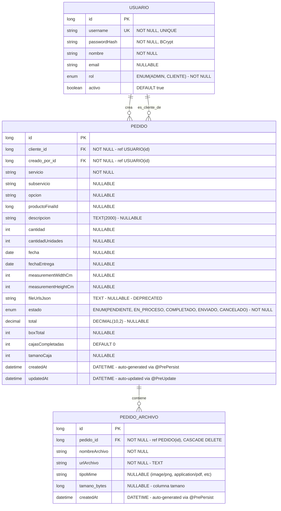

# 📊 DER RealPrint - Modelo de Datos Fiel al Backend



---

## 📋 Descripción Detallada de Entidades

### 1. **USUARIO** (tabla: `usuarios`)

| Campo | Tipo | Restricciones | Descripción |
|-------|------|---|---|
| `id` | BIGINT | PK, AUTO_INCREMENT | Identificador único |
| `username` | VARCHAR(255) | UNIQUE, NOT NULL | Nombre de usuario único para login |
| `passwordHash` | VARCHAR(255) | NOT NULL | Contraseña hasheada con BCrypt (nunca en texto plano) |
| `nombre` | VARCHAR(255) | NOT NULL | Nombre completo visible en UI |
| `email` | VARCHAR(255) | NULLABLE | Email de contacto (opcional) |
| `rol` | ENUM | NOT NULL | Rol funcional: ADMIN o CLIENTE |
| `activo` | BOOLEAN | DEFAULT TRUE | Soft-delete: false = inactivo/desactivado |

**Relaciones:**
- 1 Usuario → N Pedidos (como **cliente**: `pedidos.cliente_id` FK)
- 1 Usuario → N Pedidos (como **creador**: `pedidos.creado_por_id` FK)

**Búsquedas:**
- `findAll()` - Listar todos (ADMIN only)
- `findByUsername(String)` - Buscar para login y JWT
- `findById(Long)` - Obtener por ID

**JPA:**
```java
@OneToMany(mappedBy = "cliente")
private List<Pedido> pedidosComoCliente;

@OneToMany(mappedBy = "creadoPor")
private List<Pedido> pedidosCreados;
```

---

### 2. **PEDIDO** (tabla: `pedidos`)

| Campo | Tipo | Restricciones | Descripción |
|-------|------|---|---|
| `id` | BIGINT | PK, AUTO_INCREMENT | Identificador único |
| `cliente_id` | BIGINT | FK, NOT NULL | Usuario propietario del pedido |
| `creado_por_id` | BIGINT | FK, NOT NULL | Usuario que creó el pedido (admin o cliente) |
| `servicio` | VARCHAR(255) | NOT NULL | Tipo de servicio (serigrafía, planchado, etc) |
| `subservicio` | VARCHAR(255) | NULLABLE | Variante o especialidad |
| `opcion` | VARCHAR(255) | NULLABLE | Opción dentro del flujo |
| `productoFinalId` | BIGINT | NULLABLE | Referencia a producto (sin FK) |
| `descripcion` | TEXT | MAX 2000 chars, NULLABLE | Descripción del trabajo |
| `cantidad` | INT | NULLABLE | Cantidad base |
| `cantidadUnidades` | INT | NULLABLE | Cantidad final |
| `fecha` | DATE | NULLABLE | Fecha de creación/registro |
| `fechaEntrega` | DATE | NULLABLE | Fecha estimada entrega |
| `measurementWidthCm` | INT | NULLABLE | Ancho en cm |
| `measurementHeightCm` | INT | NULLABLE | Alto en cm |
| `fileUrlsJson` | TEXT | NULLABLE | **DEPRECATED**: Usar `pedido_archivos` en su lugar |
| `estado` | ENUM | NOT NULL | Estado actual del pedido |
| `total` | DECIMAL(10,2) | NULLABLE | Precio total |
| `boxTotal` | INT | NULLABLE | Total de cajas |
| `cajasCompletadas` | INT | DEFAULT 0 | Cajas ya completadas |
| `tamanoCaja` | INT | NULLABLE | Tamaño estándar de caja |
| `createdAt` | DATETIME | AUTO | Generado en @PrePersist |
| `updatedAt` | DATETIME | AUTO | Actualizado en @PreUpdate |

**Estados del Pedido:**
```
PENDIENTE    → Acaba de crearse, sin comenzar producción
EN_PROCESO   → Se está trabajando actualmente
COMPLETADO   → Producción terminada
ENVIADO      → Despachado al cliente
CANCELADO    → Cancelado por admin o cliente
```

**Claves Foráneas:**
- `cliente_id` → `usuarios(id)` - Nombre: `fk_pedido_cliente`
- `creado_por_id` → `usuarios(id)` - Nombre: `fk_pedido_creado_por`

**Relaciones JPA:**
```java
@ManyToOne(fetch = FetchType.LAZY, optional = false)
@JoinColumn(name = "cliente_id", nullable = false)
private Usuario cliente;

@ManyToOne(fetch = FetchType.LAZY, optional = false)
@JoinColumn(name = "creado_por_id", nullable = false)
private Usuario creadoPor;

@OneToMany(mappedBy = "pedido", cascade = CascadeType.ALL, orphanRemoval = true, fetch = FetchType.LAZY)
private List<PedidoArchivo> archivos = new ArrayList<>();
```

**Búsquedas:**
- `findAll()` - Listar todos (ADMIN, con @EntityGraph para evitar lazy loading)
- `findById(Long)` - Obtener por ID
- `findByClienteId(Long)` - Pedidos de un cliente (con @EntityGraph)
- `findByEstado(PedidoEstado)` - Filtrar por estado (ADMIN, con @EntityGraph)

---

### 3. **PEDIDO_ARCHIVO** (tabla: `pedido_archivos`)

| Campo | Tipo | Restricciones | Descripción |
|-------|------|---|---|
| `id` | BIGINT | PK, AUTO_INCREMENT | Identificador único |
| `pedido_id` | BIGINT | FK, NOT NULL, CASCADE | Referencia a pedido |
| `nombreArchivo` | VARCHAR(255) | NOT NULL | Nombre original del archivo |
| `urlArchivo` | TEXT | NOT NULL | Ruta/URL donde se almacena |
| `tipoMime` | VARCHAR(100) | NULLABLE | Tipo MIME (image/png, application/pdf, etc) |
| `tamano_bytes` | BIGINT | NULLABLE | Tamaño en bytes (columna: `tamano_bytes`) |
| `createdAt` | DATETIME | AUTO | Generado en @PrePersist |

**Clave Foránea:**
- `pedido_id` → `pedidos(id)` - Nombre: `fk_archivo_pedido` - **ON DELETE CASCADE**

**Relación JPA:**
```java
@ManyToOne(fetch = FetchType.LAZY, optional = false)
@JoinColumn(name = "pedido_id", nullable = false)
private Pedido pedido;
```

**Búsquedas:**
- `findByPedidoId(Long)` - Todos los archivos de un pedido

---

## 🔐 Conversiones de Datos (DTO ↔ Entity)

### **UsuarioDTO ↔ Usuario**

| Campo Entity | Campo DTO | Conversión |
|---|---|---|
| `passwordHash` | *(excluido)* | **NUNCA se expone** en respuestas |
| `rol` (enum) | `role` (string) | ADMIN → "admin", CLIENTE → "cliente" |

**Mapeo:**
```java
// Entity → DTO
UsuarioMapper.toDTO(usuario)
// Excluye passwordHash, convierte rol a minúsculas

// DTO → Entity
UsuarioMapper.toEntity(usuarioDTO)
// Convierte rol string a enum, no copia passwordHash
```

---

### **PedidoDTO ↔ Pedido**

| Campo Entity | Campo DTO | Conversión |
|---|---|---|
| `cliente` (objeto) | `clienteId` (long), `clienteNombre` (string) | Extrae ID y nombre |
| `creadoPor` (objeto) | `creadoPorId` (long), `creadoPorNombre` (string) | Extrae ID y nombre |
| `estado` (enum) | `estado` (string) | PENDIENTE → "pendiente", EN_PROCESO → "en_proceso", etc. |

**Mapeo:**
```java
// Entity → DTO
PedidoMapper.toDTO(pedido)
// Convierte estado a minúsculas, extrae cliente/creadoPor a IDs y nombres

// DTO → Entity
PedidoMapper.toEntity(pedidoDTO)
// Convierte estado string a enum
// Relaciones (cliente, creadoPor) asignadas por PedidoService, NO por mapper
```

---

## 🔑 Enums

### **RolUsuario** (tabla usuarios, columna rol)
```
ADMIN   → Acceso total al sistema, gestión de usuarios y pedidos
CLIENTE → Acceso solo a sus propios pedidos
```

### **PedidoEstado** (tabla pedidos, columna estado)
```
PENDIENTE   → Estado inicial, sin comenzar producción
EN_PROCESO  → Siendo procesado actualmente
COMPLETADO  → Producción terminada, listo para envío
ENVIADO     → Despachado al cliente
CANCELADO   → Cancelado por admin o cliente
```

---

## 🔐 Seguridad y Control de Acceso

### **Operaciones Restringidas**

| Endpoint | Método | Rol Requerido | Acción |
|---|---|---|---|
| GET /usuarios | GET | ADMIN | Listar todos usuarios |
| GET /usuarios/{id} | GET | ADMIN o Self | Ver usuario |
| POST /usuarios | POST | ADMIN | Crear usuario |
| PUT /usuarios/{id} | PUT | ADMIN o Self | Editar usuario |
| DELETE /usuarios/{id} | DELETE | ADMIN | Eliminar usuario |
| GET /pedidos | GET | ADMIN | Listar todos pedidos |
| GET /pedidos/{id} | GET | Cualquiera (verificar ownership) | Ver pedido |
| POST /pedidos | POST | Cualquiera | Crear pedido (asigna automáticamente cliente/creadoPor) |
| PUT /pedidos/{id} | PUT | Cualquiera (verificar ownership) | Actualizar pedido |
| DELETE /pedidos/{id} | DELETE | ADMIN | Eliminar pedido |
| POST /upload | POST | Cualquiera | Subir archivo |
| GET /files/{fileName} | GET | Autenticado (verificar ownership) | Descargar archivo |

### **Asignación Automática en Creación de Pedidos**

Cuando se crea un pedido via `POST /pedidos`:
- **cliente**: Se asigna al usuario autenticado (o puede ser especificado si es admin)
- **creadoPor**: Siempre se asigna al usuario autenticado

```java
public Pedido save(Pedido pedido, Authentication auth) {
    Usuario usuarioAutenticado = usuarioRepository.findByUsername(auth.getName());
    pedido.setCreadoPor(usuarioAutenticado);
    if (pedido.getCliente() == null) {
        pedido.setCliente(usuarioAutenticado);
    }
    return pedidoRepository.save(pedido);
}
```

---

## 📡 Flujo de Autenticación (Login)

### **Request:**
```json
POST /auth/login
{
  "username": "cliente1",
  "password": "micontraseña"
}
```

### **Response (éxito):**
```json
{
  "token": "eyJhbGciOiJIUzI1NiIsInR5cCI6IkpXVCJ9...",
  "user": {
    "id": 1,
    "username": "cliente1",
    "name": "Cliente Número Uno",
    "role": "cliente"
  }
}
```

### **Validaciones:**
1. ✅ Usuario existe en BD
2. ✅ Usuario está activo (`activo = true`)
3. ✅ Password en texto plano coincide con BCrypt hash
4. ✅ Se genera token JWT válido

### **Errores:**
- `401 Unauthorized`: Usuario no existe, contraseña incorrecta, o usuario inactivo

---

## 📤 DTOs Especializados

### **LoginRequest** (entrada)
```java
{
  "username": "string",
  "password": "string"  // Solo en HTTPS
}
```

### **LoginResponse** (salida)
```java
{
  "token": "string",    // JWT para usar en Authorization: Bearer ...
  "user": {
    "id": "long",
    "username": "string",
    "name": "string",
    "role": "string"      // Minúsculas: "admin" o "cliente"
  }
}
```

### **UsuarioDTO**
```java
{
  "id": "long",
  "username": "string",
  "nombre": "string",
  "email": "string",
  "role": "string",      // Minúsculas
  "activo": "boolean"
  // passwordHash: NUNCA
}
```

### **PedidoDTO**
```java
{
  "id": "long",
  "clienteId": "long",
  "clienteNombre": "string",
  "creadoPorId": "long",
  "creadoPorNombre": "string",
  "servicio": "string",
  "subservicio": "string",
  "opcion": "string",
  "productoFinalId": "long",
  "descripcion": "string",
  "cantidad": "int",
  "cantidadUnidades": "int",
  "fecha": "date",
  "fechaEntrega": "date",
  "measurementWidthCm": "int",
  "measurementHeightCm": "int",
  "estado": "string",     // Minúsculas: "pendiente", "en_proceso", etc.
  "fileUrlsJson": "string",
  "total": "decimal",
  "boxTotal": "int",
  "cajasCompletadas": "int",
  "tamanoCaja": "int"
}
```

---

## 🛠️ Índices Recomendados (Performance)

```sql
-- Búsquedas frecuentes
CREATE INDEX idx_usuario_username ON usuarios(username);
CREATE INDEX idx_pedido_cliente_id ON pedidos(cliente_id);
CREATE INDEX idx_pedido_creado_por_id ON pedidos(creado_por_id);
CREATE INDEX idx_pedido_estado ON pedidos(estado);
CREATE INDEX idx_pedido_fecha ON pedidos(fecha);
CREATE INDEX idx_archivo_pedido_id ON pedido_archivos(pedido_id);

-- Consultas compuestas
CREATE INDEX idx_pedido_cliente_estado ON pedidos(cliente_id, estado);
CREATE INDEX idx_pedido_cliente_fecha ON pedidos(cliente_id, fecha);
```

---

## 📋 SQL DDL (desde JPA)

```sql
CREATE TABLE usuarios (
    id BIGINT NOT NULL AUTO_INCREMENT PRIMARY KEY,
    username VARCHAR(255) NOT NULL UNIQUE,
    passwordHash VARCHAR(255) NOT NULL,
    nombre VARCHAR(255) NOT NULL,
    email VARCHAR(255),
    rol ENUM('ADMIN', 'CLIENTE') NOT NULL,
    activo BOOLEAN DEFAULT TRUE
);

CREATE TABLE pedidos (
    id BIGINT NOT NULL AUTO_INCREMENT PRIMARY KEY,
    cliente_id BIGINT NOT NULL,
    creado_por_id BIGINT NOT NULL,
    servicio VARCHAR(255) NOT NULL,
    subservicio VARCHAR(255),
    opcion VARCHAR(255),
    productoFinalId BIGINT,
    descripcion TEXT,
    cantidad INT,
    cantidadUnidades INT,
    fecha DATE,
    fechaEntrega DATE,
    measurementWidthCm INT,
    measurementHeightCm INT,
    fileUrlsJson TEXT,
    estado ENUM('PENDIENTE', 'EN_PROCESO', 'COMPLETADO', 'ENVIADO', 'CANCELADO') NOT NULL,
    total DECIMAL(10, 2),
    boxTotal INT,
    cajasCompletadas INT DEFAULT 0,
    tamanoCaja INT,
    createdAt DATETIME DEFAULT CURRENT_TIMESTAMP,
    updatedAt DATETIME DEFAULT CURRENT_TIMESTAMP ON UPDATE CURRENT_TIMESTAMP,
    CONSTRAINT fk_pedido_cliente FOREIGN KEY (cliente_id) REFERENCES usuarios(id),
    CONSTRAINT fk_pedido_creado_por FOREIGN KEY (creado_por_id) REFERENCES usuarios(id)
);

CREATE TABLE pedido_archivos (
    id BIGINT NOT NULL AUTO_INCREMENT PRIMARY KEY,
    pedido_id BIGINT NOT NULL,
    nombreArchivo VARCHAR(255) NOT NULL,
    urlArchivo TEXT NOT NULL,
    tipoMime VARCHAR(100),
    tamano_bytes BIGINT,
    createdAt DATETIME DEFAULT CURRENT_TIMESTAMP,
    CONSTRAINT fk_archivo_pedido FOREIGN KEY (pedido_id) REFERENCES pedidos(id) ON DELETE CASCADE
);
```

---

## 📐 Características del Diseño

✅ **Normalización**: 3NF (sin redundancias funcionales)  
✅ **Integridad Referencial**: FK con nombres explícitos  
✅ **Auditoría Temporal**: `createdAt`, `updatedAt` automáticos  
✅ **Soft Delete**: Campo `activo` en usuarios  
✅ **Cascade Delete**: Archivos se eliminan con pedido  
✅ **Lazy Loading**: `@ManyToOne fetch=LAZY` para rendimiento  
✅ **Entity Graphs**: `@EntityGraph` en repositorios para evitar N+1  
✅ **Enums Seguros**: Almacenados como strings en BD  
✅ **DTO Mapping**: Separación completa Entity ↔ DTO  
✅ **Security First**: Passwordhash nunca exponible, roles validados  
✅ **Ownership Validation**: Usuarios solo ven sus datos a menos que sean admin  

---

## 🔄 Ciclo de Vida de un Pedido

```
1. CREAR PEDIDO (cliente autenticado)
   ├─ POST /pedidos con datos
   ├─ Backend asigna cliente = usuario autenticado
   ├─ Backend asigna creadoPor = usuario autenticado
   ├─ estado = PENDIENTE (default)
   └─ Creado en BD

2. CLIENTE SUBE ARCHIVOS
   ├─ POST /upload (autenticado)
   ├─ Archivos almacenados en filesystem
   ├─ Registro en pedido_archivos
   └─ GET /files/{fileName} para descargar

3. ADMIN VE PEDIDO EN DASHBOARD
   ├─ GET /pedidos (solo admin)
   ├─ Ve clienteNombre y creadoPorNombre
   └─ Puede cambiar estado

4. CAMBIAR ESTADO (admin)
   ├─ PUT /pedidos/{id} con nuevo estado
   ├─ PENDIENTE → EN_PROCESO → COMPLETADO → ENVIADO
   └─ updatedAt se actualiza automáticamente

5. CLIENTE VE SUS PEDIDOS
   ├─ GET /pedidos/{id}
   └─ Valida que clienteId = usuario autenticado

6. ELIMINAR PEDIDO (solo admin)
   ├─ DELETE /pedidos/{id}
   └─ Cascada: pedido_archivos se eliminan automáticamente
```

---

## 📝 Notas Importantes

### **Campos Deprecated**
- `fileUrlsJson`: Fue reemplazado por la tabla `pedido_archivos`. Se mantiene por compatibilidad con datos legacy.

### **Campos sin Referencia FK**
- `productoFinalId`: No tiene FK definida. Podría agregarse una tabla `productos` en futuro.

### **Auditoría**
- Los timestamps `createdAt` y `updatedAt` son **100% automáticos**, gestionados por `@PrePersist` y `@PreUpdate` en la entidad.

### **Conversión de Estados**
- Frontend espera estados en minúsculas: `"pendiente"`, `"en_proceso"`, `"completado"`, `"enviado"`, `"cancelado"`
- Backend usa enums: `PENDIENTE`, `EN_PROCESO`, etc.
- Mappers hacen la conversión automáticamente

### **Control de Acceso**
- Los endpoints que aceptan "Cualquiera" validan ownership en el servicio
- Admin siempre tiene acceso total
- Clientes solo ven sus propios pedidos/archivos

---

## 🎯 Conclusión

Este DER refleja **fielmente** la implementación actual del backend RealPrint:
- Todas las relaciones JPA están documentadas
- Los mappers DTO están explicados
- La seguridad está detallada
- Los servicios siguen el flujo exacto
- Las conversiones de tipos están claras
