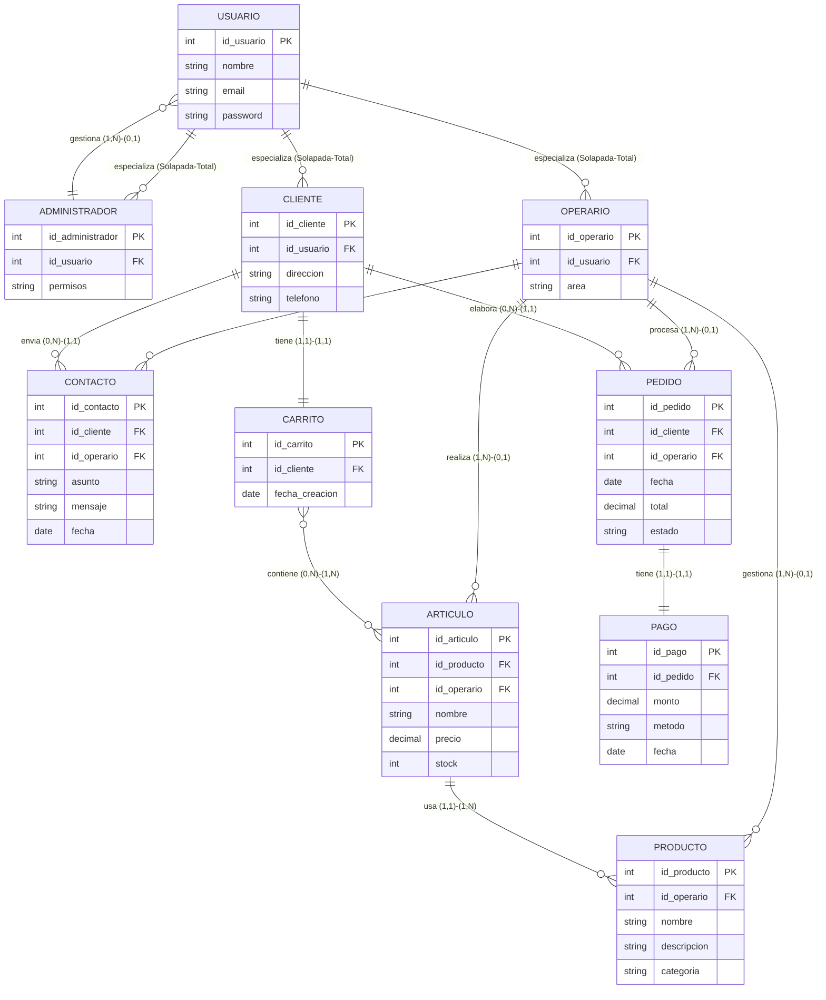

## 01. ANALISIS ENTIDAD RELACION

```mermaid
erDiagram
    USUARIO ||--o{ ADMINISTRADOR : "especializa (Solapada-Total)"
    USUARIO ||--o{ OPERARIO : "especializa (Solapada-Total)"
    USUARIO ||--o{ CLIENTE : "especializa (Solapada-Total)"
    
    ADMINISTRADOR ||--o{ USUARIO : "gestiona (1,N)-(0,1)"
    
    OPERARIO ||--o{ CONTACTO : "responde (1,N)-(0,1)"
    OPERARIO ||--o{ PEDIDO : "procesa (1,N)-(0,1)"
    OPERARIO ||--o{ ARTICULO : "realiza (1,N)-(0,1)"
    OPERARIO ||--o{ PRODUCTO : "gestiona (1,N)-(0,1)"
    
    CLIENTE ||--|| CARRITO : "tiene (1,1)-(1,1)"
    CLIENTE ||--o{ CONTACTO : "envia (0,N)-(1,1)"
    CLIENTE ||--o{ PEDIDO : "elabora (0,N)-(1,1)"
    
    PEDIDO ||--|| PAGO : "tiene (1,1)-(1,1)"
    
    CARRITO }o--o{ ARTICULO : "contiene (0,N)-(1,N)"
    
    ARTICULO ||--o{ PRODUCTO : "usa (1,1)-(1,N)"
    
    USUARIO {
        int id_usuario PK
        string nombre
        string email
        string password
    }
    
    ADMINISTRADOR {
        int id_administrador PK
        int id_usuario FK
        string permisos
    }
    
    OPERARIO {
        int id_operario PK
        int id_usuario FK
        string area
    }
    
    CLIENTE {
        int id_cliente PK
        int id_usuario FK
        string direccion
        string telefono
    }
    
    CONTACTO {
        int id_contacto PK
        int id_cliente FK
        int id_operario FK
        string asunto
        string mensaje
        date fecha
    }
    
    PEDIDO {
        int id_pedido PK
        int id_cliente FK
        int id_operario FK
        date fecha
        decimal total
        string estado
    }
    
    PAGO {
        int id_pago PK
        int id_pedido FK
        decimal monto
        string metodo
        date fecha
    }
    
    CARRITO {
        int id_carrito PK
        int id_cliente FK
        date fecha_creacion
    }
    
    ARTICULO {
        int id_articulo PK
        int id_producto FK
        int id_operario FK
        string nombre
        decimal precio
        int stock
    }
    
    PRODUCTO {
        int id_producto PK
        int id_operario FK
        string nombre
        string descripcion
        string categoria
    }

```