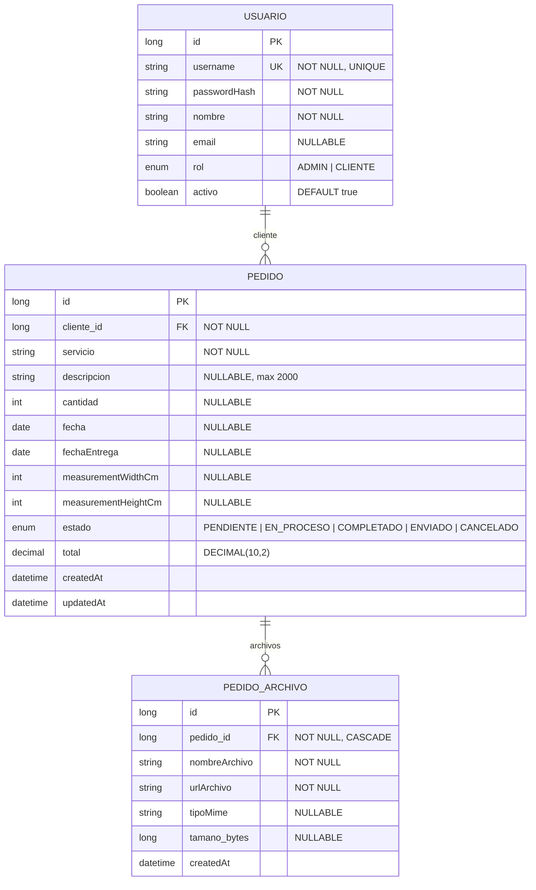

# 📊 DER RealPrint - Modelo de datos alineado con el backend actual

```mermaid
erDiagram
    USUARIO ||--o{ PEDIDO : cliente
    PEDIDO ||--o{ PEDIDO_ARCHIVO : archivos

    USUARIO {
        long id PK
        string username UK "NOT NULL, UNIQUE"
        string passwordHash "NOT NULL"
        string nombre "NOT NULL"
        string email "NULLABLE"
        enum rol "ADMIN | CLIENTE"
        boolean activo "DEFAULT true"
    }

    PEDIDO {
        long id PK
        long cliente_id FK "NOT NULL"
        string servicio "NOT NULL"
        string descripcion "NULLABLE, max 2000"
        int cantidad "NULLABLE"
        date fecha "NULLABLE"
        date fechaEntrega "NULLABLE"
        int measurementWidthCm "NULLABLE"
        int measurementHeightCm "NULLABLE"
        enum estado "PENDIENTE | EN_PROCESO | COMPLETADO | ENVIADO | CANCELADO"
        decimal total "DECIMAL(10,2)"
        datetime createdAt
        datetime updatedAt
    }

    PEDIDO_ARCHIVO {
        long id PK
        long pedido_id FK "NOT NULL, CASCADE"
        string nombreArchivo "NOT NULL"
        string urlArchivo "NOT NULL"
        string tipoMime "NULLABLE"
        long tamano_bytes "NULLABLE"
        datetime createdAt
    }
```

