# 📋 RealPrint - Casos de uso en Mermaid
Documento breve y alineado con el backend actual.

```mermaid
flowchart TB
    %% Actores
    CLIENTE([Cliente])
    ADMIN([Administrador])
    SISTEMA([Sistema / Backend])
    %% Autenticación
    subgraph A[Autenticación]
        UC1((UC-001 Login))
    end
    %% Usuarios
    subgraph U[Usuarios]
        UC2((UC-002 Crear usuario))
        UC3((UC-003 Listar usuarios))
        UC4((UC-004 Obtener/actualizar usuario))
        UC5((UC-005 Desactivar usuario))
        UC15((UC-015 Cambiar contraseña))
    end
    %% Pedidos
    subgraph P[Pedidos]
        UC6((UC-006 Crear pedido))
        UC7((UC-007 Ver mi pedido))
        UC8((UC-008 Ver todos los pedidos))
        UC9((UC-009 Cambiar estado / precio / eliminar))
    end
    %% Archivos
    subgraph F[Archivos]
        UC10((UC-010 Subir archivo))
        UC11((UC-011 Descargar archivo))
        UC12((UC-012 Ver archivos del pedido))
    end
    %% Futuros / parciales
    subgraph FTR[Futuros / parciales]
        UC13((UC-013 Notificaciones))
        UC14((UC-014 Reportes / comprobantes))
    end
    %% Relaciones por actor
    CLIENTE --> UC1
    CLIENTE --> UC6
    CLIENTE --> UC7
    CLIENTE --> UC10
    CLIENTE -.-> UC15
    ADMIN --> UC1
    ADMIN --> UC2
    ADMIN --> UC3
    ADMIN --> UC4
    ADMIN --> UC5
    ADMIN --> UC8
    ADMIN --> UC9
    ADMIN --> UC11
    SISTEMA --> UC12
    SISTEMA -.-> UC13
    SISTEMA -.-> UC14
    %% Estados visuales
    classDef partial fill:#fff4cc,stroke:#d6a100,color:#333;
    classDef future fill:#f2f2f2,stroke:#999,color:#666,stroke-dasharray: 5 5;
    class UC15 partial;
    class UC13,UC14 future;
```

## Notas breves de alineación
- `POST /auth/login` existe y devuelve JWT.
- `POST /pedidos` es solo para `CLIENTE`.
- `GET /pedidos` es solo `ADMIN`.
- `GET /pedidos/{id}` valida ownership con `@PostAuthorize`.
- `PUT /pedidos/{id}` y `DELETE /pedidos/{id}` son solo `ADMIN`.
- `POST /upload` es solo `CLIENTE`.
- `GET /files/{fileName}` es solo `ADMIN`.
- `creadoPor*` ya no forma parte del backend actual.
- `fileUrlsJson` fue sustituido por `PedidoArchivo`.
## Conclusión
Sí, Mermaid encaja bien para estos casos de uso. Esta versión deja solo lo esencial y refleja mejor el backend actual.
