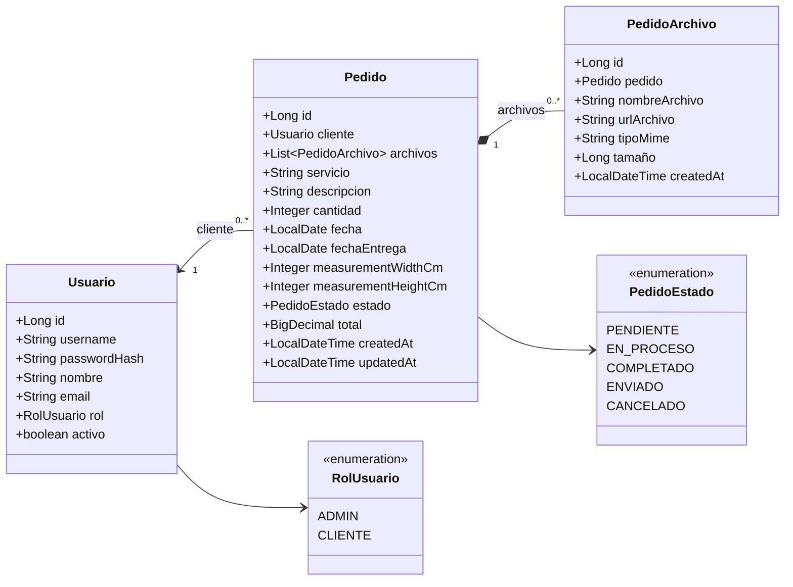

# 📘 Diagrama de clases RealPrint 

```mermaid
classDiagram
direction LR

class Usuario {
  +Long id
  +String username
  +String passwordHash
  +String nombre
  +String email
  +RolUsuario rol
  +boolean activo
}

class Pedido {
  +Long id
  +Usuario cliente
  +List~PedidoArchivo~ archivos
  +String servicio
  +String descripcion
  +Integer cantidad
  +LocalDate fecha
  +LocalDate fechaEntrega
  +Integer measurementWidthCm
  +Integer measurementHeightCm
  +PedidoEstado estado
  +BigDecimal total
  +LocalDateTime createdAt
  +LocalDateTime updatedAt
}

class PedidoArchivo {
  +Long id
  +Pedido pedido
  +String nombreArchivo
  +String urlArchivo
  +String tipoMime
  +Long tamaño
  +LocalDateTime createdAt
}

class RolUsuario {
  <<enumeration>>
  ADMIN
  CLIENTE
}

class PedidoEstado {
  <<enumeration>>
  PENDIENTE
  EN_PROCESO
  COMPLETADO
  ENVIADO
  CANCELADO
}

Usuario "1" <-- "0..*" Pedido : cliente
Pedido "1" *-- "0..*" PedidoArchivo : archivos
Pedido --> PedidoEstado
Usuario --> RolUsuario
```
