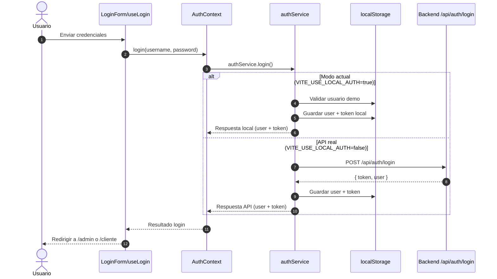
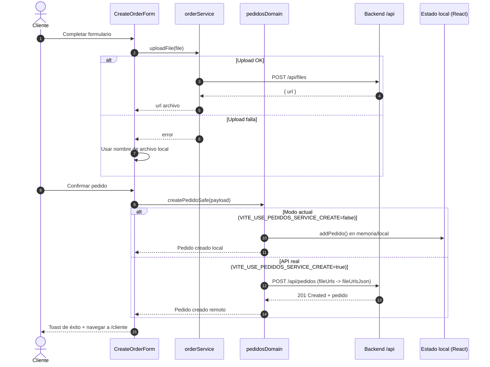

# Diagramas de secuencia minimos (RealPrint)

## 1) Login (flujo actual)

## 2) Creacion de pedido (flujo actual)

## Nota

- Estos diagramas reflejan el comportamiento por defecto actual en desarrollo.
- Las ramas de API real se activan al cambiar los flags en `frontend/.env`.

