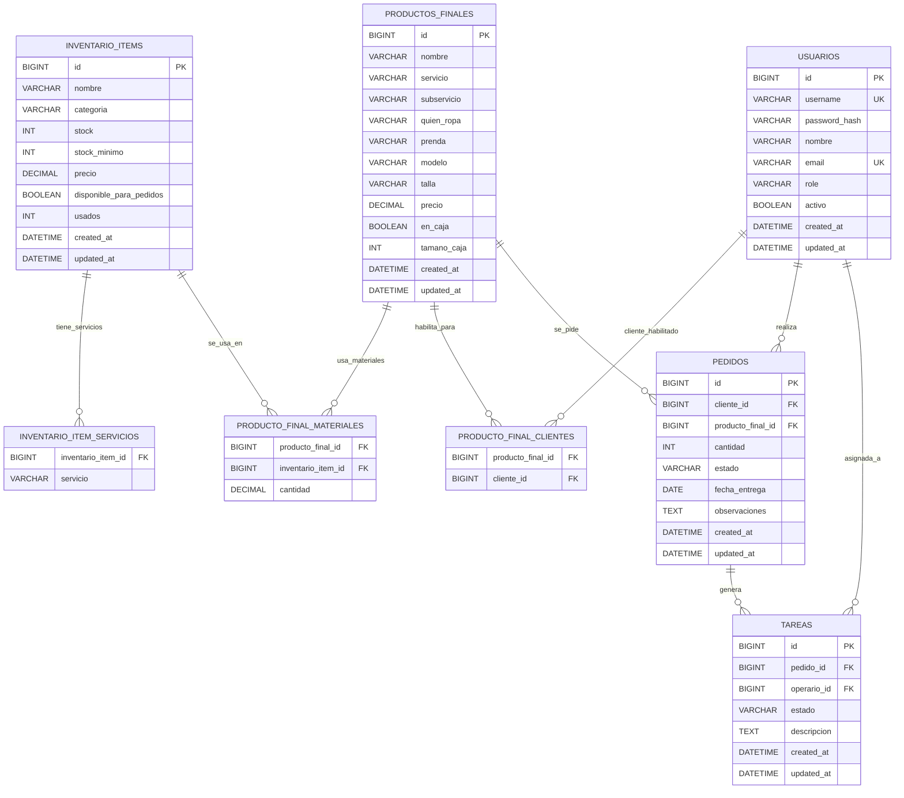

# Diagrama ER completo - RealPrint

Fecha: 2026-03-29  
Alcance: modelo ER objetivo para Spring Boot + Hibernate + MySQL, con entidades, atributos, PK/FK y cardinalidades.

## Reglas funcionales asociadas

- `USUARIOS.role` controla actor funcional (`ADMIN`, `CLIENTE`, `OPERARIO`).
- `PEDIDOS.cliente_id` debe referenciar un usuario con rol `CLIENTE`.
- `TAREAS.operario_id` debe referenciar un usuario con rol `OPERARIO`.
- Las tablas puente `PRODUCTO_FINAL_MATERIALES` y `PRODUCTO_FINAL_CLIENTES` implementan relaciones N:M.

## Referencias

- Vista solo entidades: `md/07_app_realprint/DIAGRAMA_ER_SOLO_ENTIDADES.md`
- Mapa de arquitectura objetivo: `md/07_app_realprint/MAPA_ARQUITECTURA_OBJETIVO_MYSQL_SPRINGBOOT.md`

