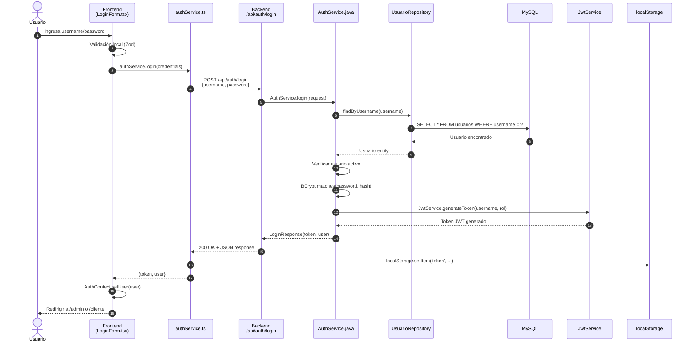
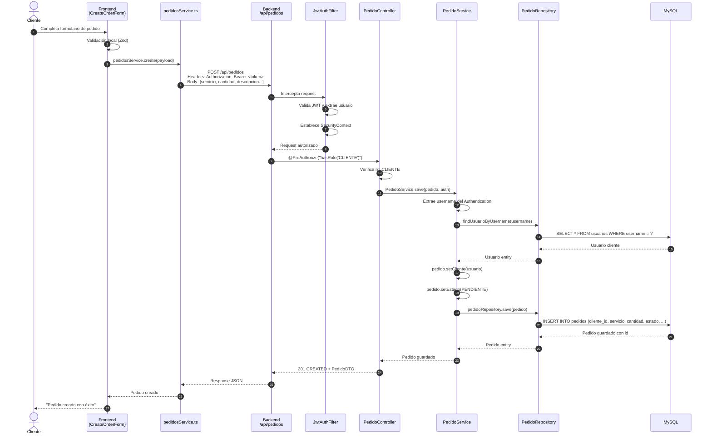
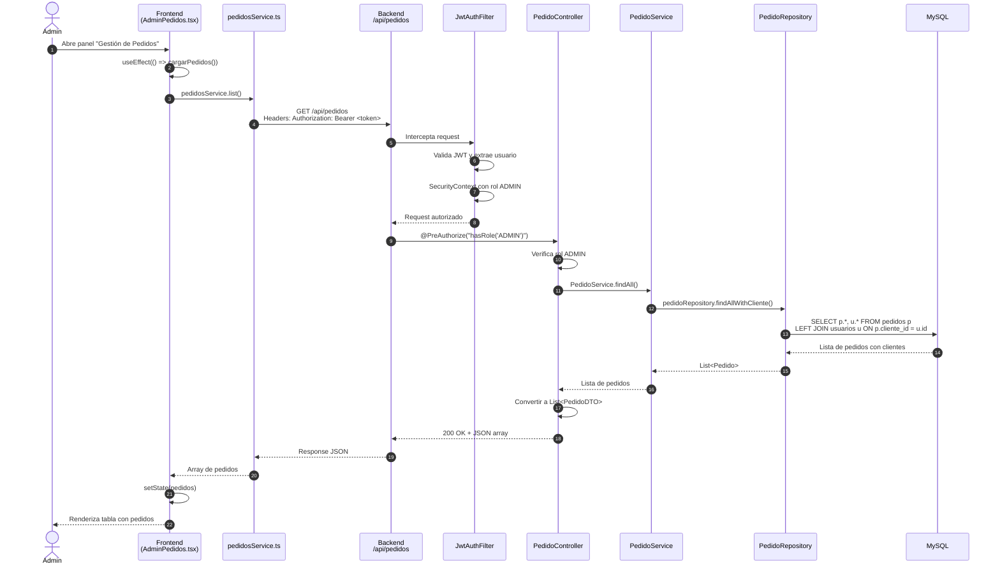
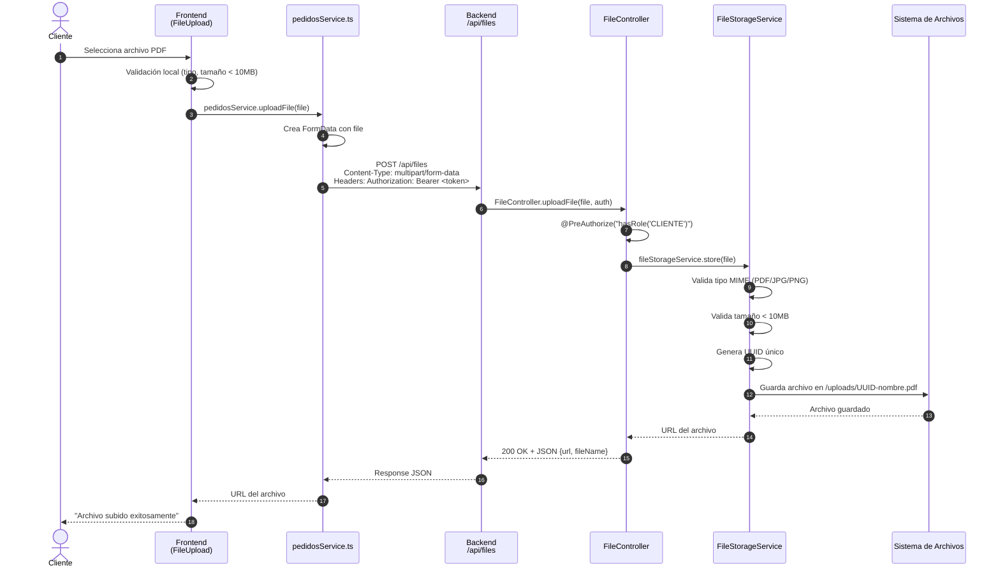

# 🔄 Flujo de Endpoints - RealPrint

**Proyecto**: Sistema de Gestión de Pedidos para Impresión  
**Stack**: React + TypeScript → Spring Boot + Java → MySQL  
**Propósito**: Explicación técnica para defensa del proyecto

---

## 📋 Índice

1. [Arquitectura General](#arquitectura-general)
2. [Flujo Completo: Login](#flujo-1-login)
3. [Flujo Completo: Crear Pedido](#flujo-2-crear-pedido-cliente)
4. [Flujo Completo: Listar Pedidos](#flujo-3-listar-pedidos-admin)
5. [Flujo de Archivos: Upload](#flujo-4-subir-archivo)
6. [Componentes Clave](#componentes-clave)
7. [Seguridad y Autorización](#seguridad-y-autorización)
8. [Anexo: Catálogo completo de endpoints](#anexo-catalogo-completo-de-endpoints)

---

## 🏗️ Arquitectura General

```
┌──────────────────────────────────────────────────────────────────┐
│                         NAVEGADOR                                 │
│  ┌────────────────────────────────────────────────────────────┐  │
│  │  FRONTEND (React + TypeScript)                             │  │
│  │  - Componentes: LoginForm, CreateOrderForm, AdminPedidos  │  │
│  │  - Services: authService.ts, pedidosService.ts            │  │
│  │  - Context: AuthContext (estado global)                   │  │
│  │  Puerto: 5173                                             │  │
│  └────────────────────────────────────────────────────────────┘  │
└──────────────────────────────────────────────────────────────────┘
                              │
                              │ HTTP Request (JSON)
                              │ Headers: Authorization: Bearer <JWT>
                              ↓
┌──────────────────────────────────────────────────────────────────┐
│                    BACKEND (Spring Boot + Java)                   │
│  ┌────────────────────────────────────────────────────────────┐  │
│  │  CAPA 1: Security Filter                                  │  │
│  │  - JwtAuthenticationFilter: Valida JWT                    │  │
│  │  - SecurityConfig: Define roles y permisos                │  │
│  └────────────────────────────────────────────────────────────┘  │
│                              ↓                                    │
│  ┌────────────────────────────────────────────────────────────┐  │
│  │  CAPA 2: Controllers (REST API)                           │  │
│  │  - AuthController: /api/auth/login                        │  │
│  │  - PedidoController: /api/pedidos                         │  │
│  │  - UsuarioController: /api/usuarios                       │  │
│  │  - FileController: /api/files                             │  │
│  └────────────────────────────────────────────────────────────┘  │
│                              ↓                                    │
│  ┌────────────────────────────────────────────────────────────┐  │
│  │  CAPA 3: Services (Lógica de Negocio)                    │  │
│  │  - AuthService: Login, generar JWT                        │  │
│  │  - PedidoService: CRUD pedidos, asignar cliente           │  │
│  │  - UsuarioService: Gestión de usuarios                    │  │
│  │  - FileStorageService: Almacenar/servir archivos          │  │
│  └────────────────────────────────────────────────────────────┘  │
│                              ↓                                    │
│  ┌────────────────────────────────────────────────────────────┐  │
│  │  CAPA 4: Repositories (Acceso a Datos)                   │  │
│  │  - UsuarioRepository: JPA queries                         │  │
│  │  - PedidoRepository: JPA queries                          │  │
│  │  - PedidoArchivoRepository: JPA queries                   │  │
│  └────────────────────────────────────────────────────────────┘  │
│  Puerto: 8080                                                     │
└──────────────────────────────────────────────────────────────────┘
                              │
                              │ SQL Queries (JPA/Hibernate)
                              ↓
┌──────────────────────────────────────────────────────────────────┐
│                    BASE DE DATOS (MySQL 8.0)                      │
│  Tablas:                                                          │
│  - usuarios (id, username, passwordHash, nombre, rol, activo)    │
│  - pedidos (id, cliente_id, servicio, estado, total, ...)        │
│  - pedido_archivos (id, pedido_id, nombreArchivo, urlArchivo)    │
│  Puerto: 3306                                                     │
└──────────────────────────────────────────────────────────────────┘
```

---

## 🔐 Flujo 1: Login

### Descripción
Usuario ingresa credenciales → Backend valida → Genera JWT → Frontend guarda token

### Diagrama de Secuencia



### Código Frontend (authService.ts)

```typescript
// 1. Frontend hace POST al backend
async login(credentials: { username: string; password: string }) {
  const response = await fetch('http://localhost:8080/api/auth/login', {
    method: 'POST',
    headers: { 'Content-Type': 'application/json' },
    body: JSON.stringify(credentials)
  });
  
  const data = await response.json();
  
  // 2. Guarda token y usuario en localStorage
  localStorage.setItem('realprint_token', data.token);
  localStorage.setItem('realprint_user', JSON.stringify(data.user));
  
  return data;
}
```

### Código Backend (AuthController.java)

```java
// 1. Controller recibe request
@PostMapping("/login")
public ResponseEntity<LoginResponse> login(@Valid @RequestBody LoginRequest request) {
    LoginResponse response = authService.login(request);
    return ResponseEntity.ok(response);
}
```

### Código Backend (AuthService.java)

```java
// 2. Service procesa la lógica de negocio
public LoginResponse login(LoginRequest request) {
    // Buscar usuario en BD
    Usuario usuario = usuarioRepository.findByUsername(request.getUsername())
            .orElseThrow(() -> new UnauthorizedException("Credenciales inválidas"));
    
    // Verificar usuario activo
    if (!usuario.getActivo()) {
        throw new UnauthorizedException("Usuario inactivo");
    }
    
    // Validar contraseña con BCrypt
    if (!passwordEncoder.matches(request.getPassword(), usuario.getPasswordHash())) {
        throw new UnauthorizedException("Credenciales inválidas");
    }
    
    // Generar JWT
    String token = jwtService.generateToken(usuario.getUsername(), usuario.getRol().name());
    
    // Construir respuesta
    return LoginResponse.builder()
            .token(token)
            .user(UsuarioMapper.toDTO(usuario))
            .build();
}
```

### Query SQL Ejecutada (JPA)

```sql
SELECT u.* 
FROM usuarios u 
WHERE u.username = 'admin'
LIMIT 1;
```

### Response JSON

```json
{
  "token": "eyJhbGciOiJIUzI1NiIsInR5cCI6IkpXVCJ9.eyJzdWIiOiJhZG1pbiIsInJvbGUiOiJBRE1JTiIsImlhdCI6MTcxNjIzOTAyMiwiZXhwIjoxNzE2MzI1NDIyfQ.abc123...",
  "user": {
    "id": 1,
    "username": "admin",
    "nombre": "Administrador",
    "role": "admin"
  }
}
```

---

## 📦 Flujo 2: Crear Pedido (Cliente)

### Descripción
Cliente completa formulario → Frontend valida → Envía a backend → Backend asigna cliente → Guarda en BD

### Diagrama de Secuencia



### Código Frontend (pedidosService.ts)

```typescript
// Frontend envía pedido con token JWT en headers
async create(payload: Pedido) {
  const token = localStorage.getItem('realprint_token');
  
  const response = await fetch('http://localhost:8080/api/pedidos', {
    method: 'POST',
    headers: {
      'Content-Type': 'application/json',
      'Authorization': `Bearer ${token}`  // JWT para autenticación
    },
    body: JSON.stringify({
      servicio: payload.servicio,
      cantidad: payload.cantidad,
      descripcion: payload.descripcion,
      fecha: payload.fecha,
      fechaEntrega: payload.fechaEntrega,
      measurementWidthCm: payload.measurementWidthCm,
      measurementHeightCm: payload.measurementHeightCm
    })
  });
  
  return await response.json();
}
```

### Código Backend (PedidoController.java)

```java
// Controller valida rol CLIENTE antes de ejecutar
@PostMapping
@PreAuthorize("hasRole('CLIENTE')")
public ResponseEntity<PedidoDTO> crearPedido(
        @Valid @RequestBody PedidoDTO pedidoDTO,
        Authentication auth) {
    
    // Convertir DTO a Entity
    Pedido pedido = PedidoMapper.toEntity(pedidoDTO);
    
    // Guardar pedido (el service asigna el cliente automáticamente)
    Pedido pedidoGuardado = pedidoService.save(pedido, auth);
    
    // Convertir Entity a DTO y devolver
    PedidoDTO responseDTO = PedidoMapper.toDTO(pedidoGuardado);
    return ResponseEntity.status(HttpStatus.CREATED).body(responseDTO);
}
```

### Código Backend (PedidoService.java)

```java
// Service asigna automáticamente el cliente desde el contexto de seguridad
public Pedido save(Pedido pedido, Authentication auth) {
    // 1. Obtener username del usuario autenticado
    String username = auth.getName();
    
    // 2. Buscar usuario en BD
    Usuario cliente = findUsuarioByUsername(username);
    
    // 3. Asignar cliente al pedido
    pedido.setCliente(cliente);
    
    // 4. Establecer estado inicial si no existe
    if (pedido.getEstado() == null) {
        pedido.setEstado(PedidoEstado.PENDIENTE);
    }
    
    // 5. Guardar en base de datos
    return pedidoRepository.save(pedido);
}
```

### Query SQL Ejecutada (JPA)

```sql
-- 1. Buscar usuario autenticado
SELECT u.* 
FROM usuarios u 
WHERE u.username = 'cliente1';

-- 2. Insertar nuevo pedido
INSERT INTO pedidos (
    cliente_id, servicio, descripcion, cantidad, 
    fecha, fecha_entrega, measurement_width_cm, 
    measurement_height_cm, estado, total, 
    created_at, updated_at
) VALUES (
    2, 'DTF', 'Camisetas personalizadas', 50, 
    '2026-05-10', '2026-05-15', 20, 
    25, 'PENDIENTE', 0.00, 
    NOW(), NOW()
);
```

### Response JSON

```json
{
  "id": 15,
  "clienteId": 2,
  "clienteNombre": "Cliente Demo",
  "servicio": "DTF",
  "descripcion": "Camisetas personalizadas",
  "cantidad": 50,
  "fecha": "2026-05-10",
  "fechaEntrega": "2026-05-15",
  "measurementWidthCm": 20,
  "measurementHeightCm": 25,
  "estado": "PENDIENTE",
  "total": 0.00,
  "createdAt": "2026-05-10T14:30:00",
  "updatedAt": "2026-05-10T14:30:00"
}
```

---

## 📋 Flujo 3: Listar Pedidos (Admin)

### Descripción
Admin accede a panel → Frontend solicita todos los pedidos → Backend verifica rol ADMIN → Devuelve lista completa

### Diagrama de Secuencia



### Código Frontend (AdminPedidos.tsx)

```typescript
// Componente React que carga pedidos al montar
useEffect(() => {
  async function cargarPedidos() {
    try {
      const pedidos = await pedidosService.list();
      setPedidos(pedidos);
    } catch (error) {
      console.error('Error al cargar pedidos:', error);
    }
  }
  
  cargarPedidos();
}, []);
```

### Código Frontend (pedidosService.ts)

```typescript
// Service hace GET al backend con JWT
async list(): Promise<Pedido[]> {
  const token = localStorage.getItem('realprint_token');
  
  const response = await fetch('http://localhost:8080/api/pedidos', {
    method: 'GET',
    headers: {
      'Authorization': `Bearer ${token}`
    }
  });
  
  return await response.json();
}
```

### Código Backend (PedidoController.java)

```java
// Controller restringido solo a ADMIN
@GetMapping
@PreAuthorize("hasRole('ADMIN')")
public ResponseEntity<Page<PedidoDTO>> listarPedidos(
        @RequestParam(defaultValue = "0") int page,
        @RequestParam(defaultValue = "20") int size) {
    
    // Obtener pedidos paginados
    Pageable pageable = PageRequest.of(page, size, Sort.by("id").descending());
    Page<Pedido> pedidosPage = pedidoService.findAll(pageable);
    
    // Convertir a DTO
    Page<PedidoDTO> dtoPage = pedidosPage.map(PedidoMapper::toDTO);
    
    return ResponseEntity.ok(dtoPage);
}
```

### Query SQL Ejecutada (JPA)

```sql
-- JPA genera query optimizada con JOIN para obtener clientes
SELECT 
    p.id, p.servicio, p.descripcion, p.cantidad, p.estado, p.total,
    p.fecha, p.fecha_entrega, p.measurement_width_cm, p.measurement_height_cm,
    p.created_at, p.updated_at,
    u.id as cliente_id, u.username, u.nombre
FROM pedidos p
LEFT JOIN usuarios u ON p.cliente_id = u.id
ORDER BY p.id DESC
LIMIT 20 OFFSET 0;
```

### Response JSON

```json
{
  "content": [
    {
      "id": 15,
      "clienteId": 2,
      "clienteNombre": "Cliente Demo",
      "servicio": "DTF",
      "descripcion": "Camisetas personalizadas",
      "cantidad": 50,
      "estado": "PENDIENTE",
      "total": 0.00,
      "fecha": "2026-05-10",
      "fechaEntrega": "2026-05-15"
    },
    {
      "id": 14,
      "clienteId": 3,
      "clienteNombre": "Juan Pérez",
      "servicio": "Rotulación",
      "descripcion": "Vinilo para vitrina",
      "cantidad": 1,
      "estado": "EN_PROCESO",
      "total": 150.00,
      "fecha": "2026-05-09",
      "fechaEntrega": "2026-05-12"
    }
  ],
  "totalElements": 42,
  "totalPages": 3,
  "size": 20,
  "number": 0
}
```

---

## 📤 Flujo 4: Subir Archivo

### Descripción
Cliente sube archivo PDF → Backend valida tipo y tamaño → Guarda en disco → Devuelve URL

### Diagrama de Secuencia



### Código Frontend (pedidosService.ts)

```typescript
// Upload con FormData para archivos binarios
async uploadFile(file: File): Promise<string> {
  const formData = new FormData();
  formData.append('file', file);
  
  const token = localStorage.getItem('realprint_token');
  
  const response = await fetch('http://localhost:8080/api/files', {
    method: 'POST',
    headers: {
      'Authorization': `Bearer ${token}`
      // NO incluir Content-Type - el navegador lo establece automáticamente
    },
    body: formData
  });
  
  const data = await response.json();
  return data.url;  // Retorna la URL del archivo guardado
}
```

### Código Backend (FileController.java)

```java
@PostMapping
@PreAuthorize("hasRole('CLIENTE')")
public ResponseEntity<Map<String, String>> uploadFile(
        @RequestParam("file") MultipartFile file,
        Authentication auth) {
    
    // Guardar archivo en disco
    String fileUrl = fileStorageService.store(file);
    String fileName = file.getOriginalFilename();
    
    // Respuesta con URL y nombre
    Map<String, String> response = Map.of(
        "url", fileUrl,
        "fileName", fileName
    );
    
    return ResponseEntity.ok(response);
}
```

### Código Backend (FileStorageService.java)

```java
public String store(MultipartFile file) {
    // 1. Validar que no esté vacío
    if (file.isEmpty()) {
        throw new RuntimeException("Archivo vacío");
    }
    
    // 2. Validar tipo MIME
    String contentType = file.getContentType();
    if (!ALLOWED_TYPES.contains(contentType)) {
        throw new RuntimeException("Tipo de archivo no permitido");
    }
    
    // 3. Validar tamaño (máx 10MB)
    if (file.getSize() > MAX_FILE_SIZE) {
        throw new RuntimeException("Archivo demasiado grande");
    }
    
    // 4. Generar nombre único con UUID
    String originalFilename = file.getOriginalFilename();
    String uniqueFilename = UUID.randomUUID().toString() + "-" + originalFilename;
    
    // 5. Guardar en disco
    Path targetPath = uploadDir.resolve(uniqueFilename);
    Files.copy(file.getInputStream(), targetPath);
    
    // 6. Retornar URL relativa
    return "/api/files/" + uniqueFilename;
}
```

### Response JSON

```json
{
  "url": "/api/files/53835eed-9042-4313-bce6-22171a00e08b-diseño.pdf",
  "fileName": "diseño.pdf"
}
```

---

## 🧩 Componentes Clave

### 1. JwtAuthenticationFilter (Backend)

**Ubicación**: `backend/src/main/java/com/realprint/realprintbackend/config/JwtAuthenticationFilter.java`

**Función**: Intercepta TODAS las peticiones HTTP y valida el JWT antes de llegar al controller.

```java
@Component
public class JwtAuthenticationFilter extends OncePerRequestFilter {
    
    @Override
    protected void doFilterInternal(
            HttpServletRequest request,
            HttpServletResponse response,
            FilterChain filterChain) throws ServletException, IOException {
        
        // 1. Extraer token del header "Authorization: Bearer <token>"
        String authHeader = request.getHeader("Authorization");
        
        if (authHeader != null && authHeader.startsWith("Bearer ")) {
            String token = authHeader.substring(7);
            
            // 2. Validar token y extraer username
            String username = jwtService.extractUsername(token);
            
            // 3. Si el token es válido, establecer contexto de seguridad
            if (username != null && jwtService.isTokenValid(token)) {
                UsernamePasswordAuthenticationToken authToken = 
                    new UsernamePasswordAuthenticationToken(username, null, authorities);
                
                SecurityContextHolder.getContext().setAuthentication(authToken);
            }
        }
        
        // 4. Continuar con la cadena de filtros
        filterChain.doFilter(request, response);
    }
}
```

**Flujo**:
1. Petición HTTP llega al backend
2. Filter extrae token del header
3. Valida token con JwtService
4. Si es válido, establece `SecurityContext` con usuario autenticado
5. Request continúa al Controller con usuario autenticado

---

### 2. @PreAuthorize (Backend)

**Función**: Anotación que valida roles ANTES de ejecutar un método del controller.

```java
// Solo usuarios con rol ADMIN pueden ejecutar este endpoint
@GetMapping("/pedidos")
@PreAuthorize("hasRole('ADMIN')")
public ResponseEntity<List<PedidoDTO>> listarPedidos() {
    // Este código solo se ejecuta si el usuario tiene rol ADMIN
    return ResponseEntity.ok(pedidoService.findAll());
}

// Solo usuarios con rol CLIENTE pueden ejecutar este endpoint
@PostMapping("/pedidos")
@PreAuthorize("hasRole('CLIENTE')")
public ResponseEntity<PedidoDTO> crearPedido(@RequestBody PedidoDTO pedido) {
    // Este código solo se ejecuta si el usuario tiene rol CLIENTE
    return ResponseEntity.ok(pedidoService.save(pedido));
}
```

**Flujo**:
1. Request pasa el `JwtAuthenticationFilter` ✅
2. Spring Security verifica la anotación `@PreAuthorize`
3. Si el rol NO coincide → Devuelve `403 Forbidden`
4. Si el rol coincide → Ejecuta el método del controller

---

### 3. httpClient (Frontend)

**Ubicación**: `frontend/src/services/httpClient.ts`

**Función**: Cliente HTTP centralizado que agrega automáticamente el JWT a cada petición.

```typescript
// Wrapper de fetch que incluye JWT automáticamente
export const httpClient = {
  async get(url: string) {
    const token = localStorage.getItem('realprint_token');
    
    const response = await fetch(`${API_BASE_URL}${url}`, {
      method: 'GET',
      headers: {
        'Content-Type': 'application/json',
        ...(token && { 'Authorization': `Bearer ${token}` })
      }
    });
    
    if (!response.ok) throw new Error('Request failed');
    return response.json();
  },
  
  async post(url: string, body: any) {
    const token = localStorage.getItem('realprint_token');
    
    const response = await fetch(`${API_BASE_URL}${url}`, {
      method: 'POST',
      headers: {
        'Content-Type': 'application/json',
        ...(token && { 'Authorization': `Bearer ${token}` })
      },
      body: JSON.stringify(body)
    });
    
    if (!response.ok) throw new Error('Request failed');
    return response.json();
  }
  
  // ... put, delete, etc.
};
```

**Ventajas**:
- Centraliza la configuración de headers
- Agrega JWT automáticamente
- Maneja errores en un solo lugar
- Evita duplicación de código

---

### 4. AuthContext (Frontend)

**Ubicación**: `frontend/src/context/AuthContext.tsx`

**Función**: Estado global que mantiene información del usuario autenticado en toda la app.

```typescript
// Context que guarda usuario y token
export const AuthContext = createContext<AuthContextType>(null);

export function AuthProvider({ children }) {
  const [user, setUser] = useState<User | null>(null);
  const [token, setToken] = useState<string | null>(null);
  
  // Al cargar la app, recuperar usuario del localStorage
  useEffect(() => {
    const storedUser = localStorage.getItem('realprint_user');
    const storedToken = localStorage.getItem('realprint_token');
    
    if (storedUser && storedToken) {
      setUser(JSON.parse(storedUser));
      setToken(storedToken);
    }
  }, []);
  
  const login = async (credentials) => {
    const response = await authService.login(credentials);
    setUser(response.user);
    setToken(response.token);
  };
  
  const logout = () => {
    localStorage.removeItem('realprint_user');
    localStorage.removeItem('realprint_token');
    setUser(null);
    setToken(null);
  };
  
  return (
    <AuthContext.Provider value={{ user, token, login, logout }}>
      {children}
    </AuthContext.Provider>
  );
}
```

**Uso en componentes**:

```typescript
// Cualquier componente puede acceder al usuario autenticado
function MiComponente() {
  const { user, logout } = useContext(AuthContext);
  
  return (
    <div>
      <p>Bienvenido, {user.nombre}</p>
      <button onClick={logout}>Cerrar Sesión</button>
    </div>
  );
}
```

---

## 🔒 Seguridad y Autorización

### Niveles de Seguridad

```
┌─────────────────────────────────────────────────────────────┐
│  NIVEL 1: Validación en Frontend (UX)                       │
│  - Zod valida formularios antes de enviar                   │
│  - Oculta botones según rol del usuario                     │
│  - Previene navegación a rutas no autorizadas               │
│  ⚠️ NO es seguridad real, solo mejora experiencia           │
└─────────────────────────────────────────────────────────────┘
                          ↓
┌─────────────────────────────────────────────────────────────┐
│  NIVEL 2: JWT en Headers (Autenticación)                    │
│  - Cada request incluye: Authorization: Bearer <token>      │
│  - JwtAuthenticationFilter valida el token                  │
│  - Si token es inválido → 401 Unauthorized                  │
│  - Si token es válido → Establece SecurityContext           │
└─────────────────────────────────────────────────────────────┘
                          ↓
┌─────────────────────────────────────────────────────────────┐
│  NIVEL 3: @PreAuthorize (Autorización por Rol)              │
│  - Spring Security verifica el rol antes de ejecutar        │
│  - @PreAuthorize("hasRole('ADMIN')")                        │
│  - Si rol no coincide → 403 Forbidden                       │
│  - Si rol coincide → Ejecuta método                         │
└─────────────────────────────────────────────────────────────┘
                          ↓
┌─────────────────────────────────────────────────────────────┐
│  NIVEL 4: Lógica de Negocio (Service Layer)                 │
│  - Asigna cliente automáticamente desde SecurityContext     │
│  - Valida que el usuario solo acceda a SUS datos            │
│  - Verifica estado de pedidos antes de modificar            │
└─────────────────────────────────────────────────────────────┘
```

### Ejemplo de Seguridad Multi-Capa

**Caso**: Cliente intenta acceder a pedidos de OTRO cliente

```
❌ Escenario de Ataque:
   - Cliente A (id=2) intenta: GET /api/pedidos/15
   - Pero el pedido 15 pertenece a Cliente B (id=3)
```

**Defensa Multi-Capa**:

1. **Frontend** (Opcional): No muestra botón para acceder a pedidos de otros
   
2. **JWT Validation**: El token identifica al Cliente A correctamente ✅

3. **Controller**: Valida que el usuario tenga rol CLIENTE ✅

4. **Service**: Verifica que el pedido pertenezca al cliente autenticado

```java
public Pedido findById(Long id, Authentication auth) {
    Pedido pedido = pedidoRepository.findById(id)
            .orElseThrow(() -> new PedidoNoEncontradoException("Pedido no encontrado"));
    
    // Si es CLIENTE, validar que sea el dueño
    if (auth.getAuthorities().contains("ROLE_CLIENTE")) {
        String username = auth.getName();
        Usuario cliente = findUsuarioByUsername(username);
        
        if (!pedido.getCliente().getId().equals(cliente.getId())) {
            throw new UnauthorizedException("No tienes permiso para ver este pedido");
        }
    }
    
    return pedido;
}
```

**Resultado**: Cliente A recibe `403 Forbidden` ❌

---

## 📚 Anexo: Catálogo completo de endpoints

> **Contexto base**: el backend expone todos los endpoints bajo el prefijo `/api` (context-path configurado en `application.yml`).

### Resumen total

El backend de `RealPrint` expone **16 endpoints funcionales** distribuidos en 4 controladores:

| # | Área | Método | Endpoint completo | Rol / acceso | Propósito |
|---|---|---|---|---|---|
| 1 | Autenticación | POST | `/api/auth/login` | Público | Iniciar sesión y devolver JWT |
| 2 | Pedidos | GET | `/api/pedidos` | ADMIN | Listar pedidos paginados |
| 3 | Pedidos | GET | `/api/pedidos/mis-pedidos` | CLIENTE | Ver los pedidos del usuario autenticado |
| 4 | Pedidos | GET | `/api/pedidos/{id}` | ADMIN o propietario | Ver detalle de un pedido |
| 5 | Pedidos | POST | `/api/pedidos` | CLIENTE | Crear un nuevo pedido |
| 6 | Pedidos | PUT | `/api/pedidos/{id}` | ADMIN o cliente autorizado | Actualizar un pedido |
| 7 | Pedidos | DELETE | `/api/pedidos/{id}` | ADMIN | Eliminar un pedido |
| 8 | Pedidos | POST | `/api/pedidos/{pedidoId}/archivos` | CLIENTE | Agregar archivo a un pedido |
| 9 | Usuarios | GET | `/api/usuarios` | ADMIN | Listar usuarios paginados |
| 10 | Usuarios | GET | `/api/usuarios/{id}` | ADMIN o self | Ver detalle de un usuario |
| 11 | Usuarios | POST | `/api/usuarios` | ADMIN | Crear usuario |
| 12 | Usuarios | PUT | `/api/usuarios/{id}` | ADMIN o self | Actualizar usuario |
| 13 | Usuarios | PUT | `/api/usuarios/{id}/cambiar-password` | ADMIN o self | Cambiar contraseña |
| 14 | Usuarios | DELETE | `/api/usuarios/{id}` | ADMIN | Eliminar usuario |
| 15 | Archivos | POST | `/api/files` | CLIENTE | Subir archivo al sistema |
| 16 | Archivos | GET | `/api/files/{fileName}` | ADMIN | Descargar archivo |

---

### 8.1 Endpoints de autenticación

#### `POST /api/auth/login`
- **Controller**: `AuthController`
- **Servicio**: `AuthService`
- **Acceso**: público
- **Entrada**: `LoginRequest { username, password }`
- **Salida**: `LoginResponse { token, user }`
- **Uso**: autenticar al usuario y crear la sesión JWT del frontend.

**Flujo resumido**:
1. El usuario envía credenciales desde el login.
2. El backend valida usuario, estado y contraseña.
3. Se genera el JWT.
4. El frontend lo guarda y lo reutiliza en las peticiones protegidas.

---

### 8.2 Endpoints de pedidos

#### `GET /api/pedidos`
- **Controller**: `PedidoController`
- **Acceso**: `ADMIN`
- **Uso**: listar todos los pedidos con paginación y ordenación.

#### `GET /api/pedidos/mis-pedidos`
- **Controller**: `PedidoController`
- **Acceso**: `CLIENTE`
- **Uso**: recuperar exclusivamente los pedidos del usuario autenticado.

#### `GET /api/pedidos/{id}`
- **Controller**: `PedidoController`
- **Acceso**: validación por regla personalizada (`@PostAuthorize`)
- **Uso**: ver el detalle de un pedido concreto.

#### `POST /api/pedidos`
- **Controller**: `PedidoController`
- **Acceso**: `CLIENTE`
- **Uso**: crear un pedido nuevo con servicio, descripción, cantidad, medidas y fechas.

#### `PUT /api/pedidos/{id}`
- **Controller**: `PedidoController`
- **Acceso**: validación por regla personalizada (`@PreAuthorize`)
- **Uso**: actualizar datos del pedido según permisos del usuario.

#### `DELETE /api/pedidos/{id}`
- **Controller**: `PedidoController`
- **Acceso**: `ADMIN`
- **Uso**: eliminar un pedido existente.

#### `POST /api/pedidos/{pedidoId}/archivos`
- **Controller**: `PedidoController`
- **Acceso**: validación por regla personalizada (`@PreAuthorize`)
- **Uso**: agregar un archivo a un pedido existente
- **Formato**: `multipart/form-data`
- **Tipos admitidos**: PDF, JPG, PNG
- **Límite**: 10 MB

**Observación**: este bloque cubre el ciclo completo de gestión de pedidos: listado global, listado personal, consulta, creación, edición, eliminación y gestión de archivos.

---

### 8.3 Endpoints de usuarios

#### `GET /api/usuarios`
- **Controller**: `UsuarioController`
- **Acceso**: `ADMIN`
- **Uso**: listar usuarios con paginación.

#### `GET /api/usuarios/{id}`
- **Controller**: `UsuarioController`
- **Acceso**: `ADMIN` o el propio usuario
- **Uso**: consultar el perfil de un usuario específico.

#### `POST /api/usuarios`
- **Controller**: `UsuarioController`
- **Acceso**: `ADMIN`
- **Uso**: crear un usuario nuevo.

#### `PUT /api/usuarios/{id}`
- **Controller**: `UsuarioController`
- **Acceso**: `ADMIN` o el propio usuario
- **Uso**: actualizar datos de usuario.

#### `PUT /api/usuarios/{id}/cambiar-password`
- **Controller**: `UsuarioController`
- **Acceso**: `ADMIN` o el propio usuario
- **Uso**: cambiar la contraseña de un usuario
- **Entrada**: `ChangePasswordRequest { passwordActual, passwordNueva }`
- **Validación**: verifica que la contraseña actual sea correcta antes de cambiarla

#### `DELETE /api/usuarios/{id}`
- **Controller**: `UsuarioController`
- **Acceso**: `ADMIN`
- **Uso**: eliminar o desactivar un usuario según la lógica interna del servicio.

**Observación**: estos endpoints soportan la parte administrativa del sistema y el mantenimiento de cuentas de cliente/administrador.

---

### 8.4 Endpoints de archivos

#### `POST /api/files`
- **Controller**: `FileController`
- **Acceso**: `CLIENTE`
- **Uso**: subir archivos relacionados con pedidos.
- **Formato**: `multipart/form-data`
- **Tipos admitidos**: PDF, JPG, PNG
- **Límite**: 10 MB

#### `GET /api/files/{fileName}`
- **Controller**: `FileController`
- **Acceso**: `ADMIN`
- **Uso**: descargar el archivo almacenado en el servidor.
- **Integración Frontend**: `AdminPedidos` página → Modal de detalles

**Observación técnica**: 
- La subida devuelve una URL construida con `ServletUriComponentsBuilder`
- La descarga sirve el recurso con `Content-Type` y `Content-Disposition` adecuados
- **Integración UI completada** (v2.0):
  - Servicio: `fileService.ts` (validación de URLs, descarga con JWT, fallbacks)
  - Hook: `useFileDownload` (gestión de estado de descarga)
  - Componente: `FileList.tsx` (renderiza archivos descargables)
  - Los administradores pueden descargar archivos directamente desde el panel de pedidos

---

### 8.5 Mapa rápido de permisos

| Rol | Puede hacer |
|---|---|
| **ADMIN** | Listar usuarios, crear usuarios, editar usuarios, eliminar usuarios, listar pedidos globales, consultar pedidos, actualizar pedidos, eliminar pedidos, descargar archivos |
| **CLIENTE** | Iniciar sesión, crear pedidos, ver sus propios pedidos, ver su propio usuario, actualizar su propio usuario, subir archivos |
| **Público** | Solo `POST /api/auth/login` |

### 8.6 Resumen para defensa oral

Si en la defensa te preguntan por los endpoints, la respuesta corta y correcta es:

- El backend expone **16 endpoints**.
- Hay **4 controladores REST**: autenticación, pedidos, usuarios y archivos.
- La seguridad combina **JWT**, **Spring Security** y reglas por rol con `@PreAuthorize` / `@PostAuthorize`.
- El frontend React consume esos endpoints por `fetch`/servicios, enviando el token en `Authorization: Bearer <JWT>`.

---

## 📊 Resumen: Flujo Completo de un Request

### Ejemplo: Cliente crea un pedido

```
1️⃣ FRONTEND
   ↓ Usuario completa formulario
   ↓ Zod valida datos localmente
   ↓ fetch('POST /api/pedidos', { headers: { Authorization: Bearer <JWT> } })
   
2️⃣ BACKEND - SECURITY LAYER
   ↓ JwtAuthenticationFilter intercepta request
   ↓ Valida JWT y extrae username + rol
   ↓ Establece SecurityContext con usuario autenticado
   
3️⃣ BACKEND - CONTROLLER
   ↓ @PreAuthorize("hasRole('CLIENTE')") verifica rol
   ↓ Si rol correcto → Ejecuta crearPedido()
   ↓ Si rol incorrecto → 403 Forbidden
   
4️⃣ BACKEND - SERVICE
   ↓ PedidoService.save(pedido, auth)
   ↓ Extrae username del Authentication
   ↓ Busca Usuario en BD por username
   ↓ Asigna cliente al pedido automáticamente
   ↓ Establece estado PENDIENTE
   
5️⃣ BACKEND - REPOSITORY
   ↓ pedidoRepository.save(pedido)
   ↓ JPA genera SQL INSERT
   
6️⃣ BASE DE DATOS
   ↓ MySQL ejecuta INSERT INTO pedidos (...)
   ↓ Devuelve pedido con ID generado
   
7️⃣ BACKEND - RESPUESTA
   ↓ Convierte Pedido entity → PedidoDTO
   ↓ Serializa a JSON
   ↓ ResponseEntity.ok(dto)
   
8️⃣ FRONTEND - RECEPCIÓN
   ↓ httpClient recibe JSON
   ↓ Actualiza estado React
   ↓ Renderiza componente con nuevo pedido
   ↓ Muestra toast "Pedido creado con éxito"
```

### Ejemplo: Usuario inicia sesión

```
1️⃣ FRONTEND
   ↓ Usuario escribe username y password
   ↓ LoginForm valida con Zod
   ↓ authService.login(credentials)

2️⃣ BACKEND - CONTROLLER
   ↓ POST /api/auth/login
   ↓ AuthController recibe LoginRequest

3️⃣ BACKEND - SERVICE
   ↓ AuthService busca usuario por username
   ↓ Verifica que esté activo
   ↓ Comprueba password con BCrypt
   ↓ Genera JWT con rol y username

4️⃣ BACKEND - RESPUESTA
   ↓ Devuelve LoginResponse { token, user }
   ↓ HTTP 200 OK

5️⃣ FRONTEND - SESIÓN
   ↓ Guarda token en localStorage
   ↓ Guarda usuario en AuthContext
   ↓ Redirige según rol (ADMIN / CLIENTE)
```

### Ejemplo: Administrador lista pedidos

```
1️⃣ FRONTEND
   ↓ Admin abre el dashboard de pedidos
   ↓ useEffect carga la lista automáticamente
   ↓ pedidosService.list()

2️⃣ BACKEND - SECURITY
   ↓ Llega GET /api/pedidos con Bearer token
   ↓ JwtAuthenticationFilter valida el JWT
   ↓ Spring Security confirma rol ADMIN

3️⃣ BACKEND - CONTROLLER
   ↓ PedidoController.listarPedidos()
   ↓ @PreAuthorize("hasRole('ADMIN')")

4️⃣ BACKEND - SERVICE / REPOSITORY
   ↓ PedidoService.findAll(pageable)
   ↓ pedidoRepository.findAll(...)
   ↓ JPA obtiene pedidos y clientes asociados

5️⃣ BACKEND - RESPUESTA
   ↓ Convierte entidades a PedidoDTO
   ↓ Devuelve Page<PedidoDTO> en JSON

6️⃣ FRONTEND - RENDER
   ↓ React guarda la lista en estado
   ↓ Se renderiza la tabla de pedidos
```

### Ejemplo: Cliente sube un archivo

```
1️⃣ FRONTEND
   ↓ Cliente selecciona PDF/JPG/PNG
   ↓ Validación local de tipo y tamaño
   ↓ Se crea FormData con el archivo
   ↓ uploadFile(file)

2️⃣ BACKEND - CONTROLLER
   ↓ POST /api/files
   ↓ FileController recibe MultipartFile
   ↓ @PreAuthorize("@securityRules.canUploadFile(authentication)")

3️⃣ BACKEND - SERVICE
   ↓ FileStorageService.store(file)
   ↓ Valida tamaño máximo 10 MB
   ↓ Valida extensión / MIME permitido
   ↓ Genera nombre único con UUID
   ↓ Guarda archivo en /uploads/

4️⃣ BACKEND - RESPUESTA
   ↓ Devuelve JSON con url y fileName
   ↓ HTTP 200 OK

5️⃣ FRONTEND - RESULTADO
    ↓ Muestra confirmación al usuario
    ↓ Guarda la URL para asociarla al pedido
```

### Ejemplo: Admin descarga un archivo

```
1️⃣ FRONTEND
    ↓ Admin abre modal de detalles del pedido
    ↓ Ve lista de archivos con botones "Descargar"
    ↓ useFileDownload hook gestiona estado
    ↓ Click en "Descargar archivo X"

2️⃣ FRONTEND - VALIDACIÓN
    ↓ fileService.isDownloadableUrl() valida origen
    ↓ Previene directory traversal
    ↓ Whitelist de orígenes CORS

3️⃣ FRONTEND - REQUEST
    ↓ fetch(GET /api/files/uuid-fileName.pdf)
    ↓ Header: Authorization: Bearer <JWT>
    ↓ Indicador visual: "Descargando..."

4️⃣ BACKEND - SEGURIDAD
    ↓ JwtAuthenticationFilter valida token
    ↓ @PreAuthorize("hasRole('ADMIN')") verifica rol
    ↓ Si no es ADMIN → 403 Forbidden

5️⃣ BACKEND - SERVICE
    ↓ FileStorageService.load(fileName)
    ↓ Valida que archivo existe
    ↓ Resuelve MIME type (PDF, JPEG, PNG)
    ↓ Normaliza path (previene ../../../etc)

6️⃣ BACKEND - RESPUESTA
    ↓ Devuelve contenido binario (blob)
    ↓ Headers: Content-Type, Content-Disposition: attachment
    ↓ HTTP 200 OK

7️⃣ FRONTEND - DESCARGA NATIVA
    ↓ Blob recibido
    ↓ Genera ObjectURL temporal
    ↓ Crea elemento <a> con href=blob
    ↓ Establece download attribute con nombre amigable
    ↓ Simula click() → navegador descarga archivo
    ↓ Limpia URL con URL.revokeObjectURL()

8️⃣ FRONTEND - RESULTADO
    ↓ Archivo guardado en Descargas/
    ↓ Nombre: uuid-nombreOriginal.tipo
    ↓ Indicador desaparece
```

---

## 🎯 Puntos Clave para la Defensa

### 1. **Separación de Responsabilidades**
   - **Controller**: Solo recibe y devuelve datos (capa REST)
   - **Service**: Lógica de negocio y validaciones
   - **Repository**: Acceso a datos (JPA automático)

### 2. **Seguridad en Múltiples Capas**
   - JWT valida identidad
   - @PreAuthorize valida roles
   - Service valida propiedad de recursos

### 3. **Arquitectura RESTful**
   - Endpoints claros: `GET /pedidos`, `POST /pedidos/{id}`
   - Códigos HTTP correctos: 200, 201, 400, 401, 403, 404
   - JSON como formato de intercambio

### 4. **Estado Global en Frontend**
   - AuthContext mantiene usuario autenticado
   - localStorage persiste sesión entre recargas
   - JWT enviado automáticamente en cada request

### 5. **Validación Dual**
   - Frontend: Validación con Zod (mejor UX)
   - Backend: Validación con Bean Validation (seguridad real)

### 6. **Trazabilidad**
   - Cada pedido se asocia al cliente que lo creó
   - Timestamps automáticos (createdAt, updatedAt)
   - Security Context identifica quién hace cada acción

---

**Fin del Documento**

*Este documento explica técnicamente el flujo de endpoints de RealPrint, desde que el usuario hace una acción en el navegador hasta que se persiste en la base de datos y se devuelve la respuesta.*